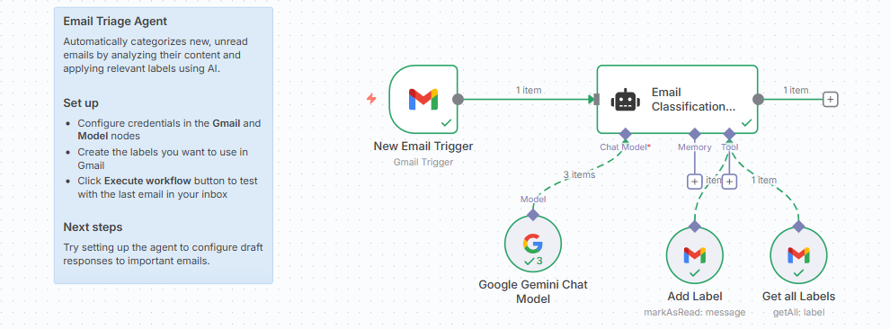

# 📧 Email Triage Agent

An **AI-powered email assistant** that automatically categorizes new, unread emails by analyzing their content and applying relevant labels in Gmail.  
Built with [n8n](https://n8n.io/) + [LangChain](https://www.langchain.com/).  

---

## ⚙️ Setup

1. 🔑 Configure credentials in the **Gmail** and **Model** nodes  
2. 🏷️ Create the labels you want to use in your Gmail account  
3. ▶️ Click the **Execute Workflow** button in n8n to test with the last email in your inbox  

---

## 🚀 Next Steps

- ✉️ Extend the agent to **draft responses** for important emails  
- 🗂️ Add more sophisticated **categorization rules** (e.g., Work, Personal, Finance, Marketing)  
- 🔔 Integrate with **Slack or Telegram** for notifications when a high-priority email arrives  

---

## 📌 Example Flow

---

## 🙌 Acknowledgments

- 📧 [Gmail API](https://developers.google.com/gmail/api) – Email access & labeling  
- ⚡ [n8n](https://n8n.io/) – Workflow automation  
- 🧠 [LangChain](https://www.langchain.com/) – AI-powered classification  

## 🖼️ Gmail Label Screenshot

